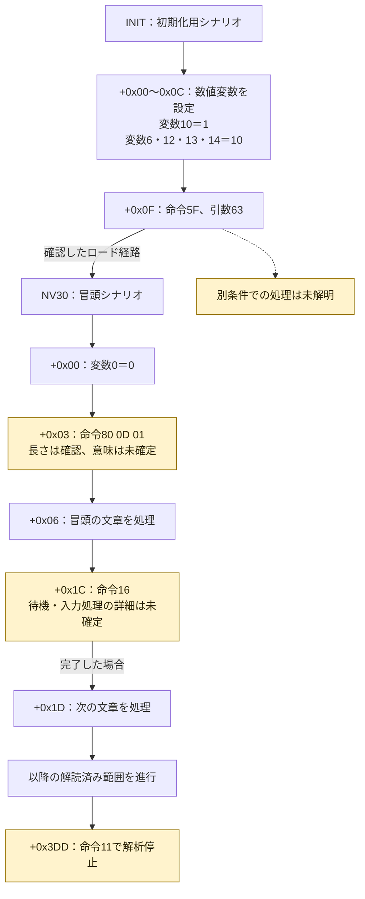
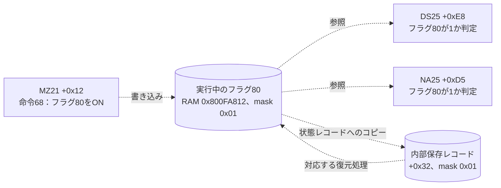
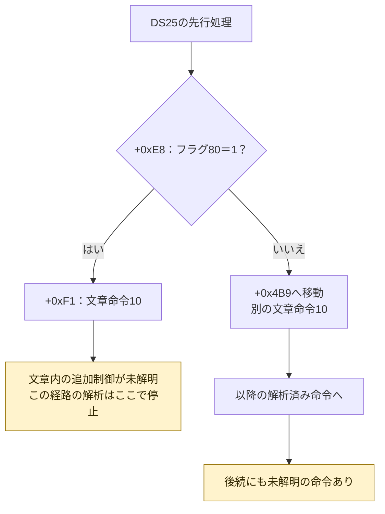
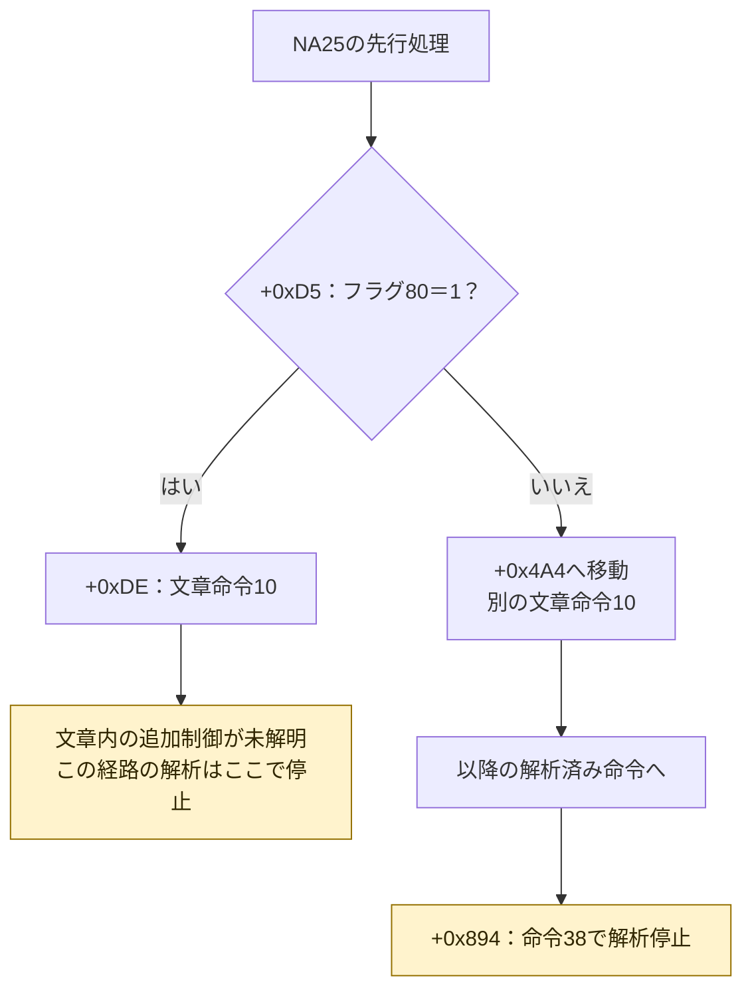

# ONE シナリオのフローチャート

2026-09-20。対象はDisc 1 / SLPS-01972。
既存の命令解析結果とコードの照合から作成した部分図。
場面名は実行ファイルに残った名前。変数の意味は未確定。
アドレスではなく、各展開済みシナリオ内の相対位置を `+0x...` で示す。

## 初期化から冒頭へ

INITの5つの代入値は冒頭RAMと一致。NV30の展開結果36,619バイトもRAMと一致した。
命令16は条件が満たされるまで同じ位置に留まる処理を含む。
図の矢印は即時に次へ進むことを意味しない。

## フラグ80の受け渡し

この図の点線は、同じ状態を読み書きする関係。場面間の直接移行ではない。
保存先もカードファイル内オフセットではなく、内部の128バイトレコード内の位置。

フラグ80の物語上の意味、ほかの書込み箇所、これらの場面へ到達する条件は未確定。
非ゼロのフラグを実カードへ保存してロードする往復検証も未実施。

## DS25のフラグ80による分岐

根拠となる命令列は `52 01 50 40 01 01 00 B9 04`。
単一条件を比較し、成立時は次の命令、不成立時はLEの指定位置0x04B9へ進む。

## NA25のフラグ80による分岐

根拠となる命令列は `52 01 50 40 01 01 00 A4 04`。
DS25と同じ判定の形で、移動先が0x04A4に変わる。

## 根拠と範囲

- ローカル解析結果: `.tools/redux-analysis/flag-map/analysis.json` と `references.csv`。
- 使用した資源: INIT=036.bin、NV30=063.bin、MZ21=058.bin、DS25=034.bin、NA25=082.bin。
- 条件命令: 0x8001A5AC以降。今回の比較セレクター1は等値比較。
  条件成立時の直後への進行は0x8001A810、不成立時の位置設定は0x8001A820以降。
- [スクリプトの確認](one-script-evidence.ja.md)、[フラグ対応表](one-flag-map.ja.md)、
  [保存用内部レコード](one-save-state-layout.ja.md)。

全体の物語分岐図ではない。解読済み範囲を可視化したものであり、未解明部分を
つないで推測のルートを作ることはしていない。
